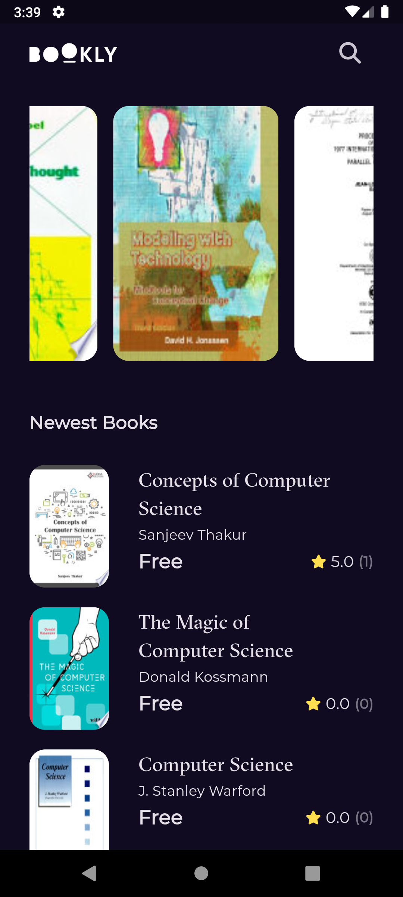
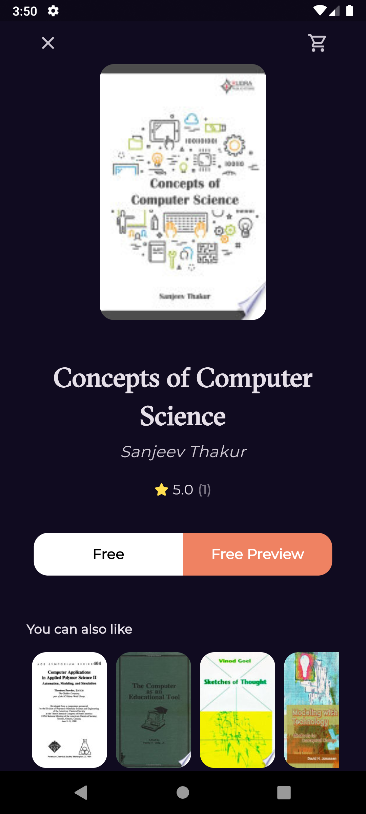

# 📚 Bookly - Free Books Discovery App

Bookly is a cross-platform mobile application built with Flutter that allows users to discover, search, and preview thousands of free books from the Google Books API. With its elegant dark-themed UI and smooth user experience, Bookly makes finding your next read a delightful experience.

---

## 📸 Screenshots (Example placeholders)

## 🚀 Splash Screen

<p align="center">
  
</p>

---


## 🏠 Home Screen

<p align="center">
  
</p>

---

## 🔑 Book details Screen

<p align="center">
  
</p>

---

## 🧾 Search Screen
<p align="center">
  
  
</p>


---

## ✨ Features

### 🎯 Core Features
- **Featured Books**: Curated collection of popular computer science books
- **Newest Books**: Stay updated with the latest additions
- **Smart Search**: Real-time search functionality with instant results
- **Book Details**: Comprehensive information including ratings, authors, and descriptions
- **Similar Books**: Discover related books based on categories
- **Free Preview**: Direct links to preview books online
- **Book Ratings**: View average ratings and total review counts

### 🎨 UI/UX Features
- **Dark Mode**: Eye-friendly dark theme throughout the app
- **Smooth Animations**: Engaging splash screen with animated transitions
- **Responsive Design**: Optimized for various screen sizes
- **Custom Widgets**: Reusable components for consistent design
- **Loading States**: Elegant loading indicators for better UX
- **Error Handling**: User-friendly error messages
- **Cached Images**: Fast image loading with caching

## 📱 Screenshots

> Add your app screenshots here

```
[Home Screen] [Book Details] [Search Results]
```

## 🚀 Getting Started

### Prerequisites

- Flutter SDK (3.8.1 or higher)
- Dart SDK (3.8.1 or higher)
- Android Studio / VS Code
- iOS Simulator / Android Emulator

### Installation

1. **Clone the repository**
```bash
git clone https://github.com/mohamed-oraby10/bookly_app.git
cd bookly_app
```

2. **Install dependencies**
```bash
flutter pub get
```

3. **Run the app**
```bash
flutter run
```

### Building for Production

**Android:**
```bash
flutter build apk --release
```

**iOS:**
```bash
flutter build ios --release
```

## 🏗️ Architecture

This project follows **Clean Architecture** principles with clear separation of concerns:

```
lib/
├── core/
│   ├── api_service.dart          # API service layer
│   ├── errors/                   # Error handling
│   ├── utils/                    # Utilities and helpers
│   └── widgets/                  # Reusable widgets
├── Features/
│   ├── Home/
│   │   ├── data/
│   │   │   ├── models/          # Data models
│   │   │   └── repos/           # Repository implementations
│   │   └── presentation/
│   │       ├── manager/         # BLoC/Cubit state management
│   │       └── views/           # UI screens and widgets
│   ├── Search/
│   │   ├── data/
│   │   └── presentation/
│   └── Splash/
│       └── presentation/
└── main.dart
```

### Design Patterns Used
- **Repository Pattern**: Abstraction layer for data sources
- **BLoC Pattern**: State management with Cubit
- **Dependency Injection**: Using GetIt service locator
- **Factory Pattern**: Model creation from JSON
- **Observer Pattern**: Reactive state updates

## 🛠️ Technologies Used

### Core
- **Flutter** - UI framework
- **Dart** - Programming language

### State Management
- **flutter_bloc** (9.1.1) - BLoC/Cubit pattern implementation

### Networking
- **dio** (5.9.0) - HTTP client for API calls
- **cached_network_image** (3.4.1) - Image caching

### Navigation
- **go_router** (16.3.0) - Declarative routing

### Functional Programming
- **dartz** (0.10.1) - Functional programming utilities (Either, Option)

### Dependency Injection
- **get_it** (8.0.2) - Service locator

### UI Components
- **google_fonts** (6.3.2) - Custom fonts
- **font_awesome_flutter** (10.9.1) - Icon library

### Utilities
- **url_launcher** (6.3.2) - Launch URLs
- **equatable** (2.0.7) - Value equality

## 📦 Project Structure

### Data Layer
- **Models**: Book models with Equatable for value comparison
- **Repositories**: Abstract interfaces and implementations
- **API Service**: Centralized API call handling

### Presentation Layer
- **Cubits**: State management for each feature
- **Views**: Screen widgets
- **Widgets**: Reusable UI components

### Core Layer
- **Error Handling**: Custom failure classes
- **Utils**: Helper functions and constants
- **Widgets**: Shared components

## 🔑 Key Implementations

```

## 🌐 API Integration

The app uses the **Google Books API** for fetching book data:

- Base URL: `https://www.googleapis.com/books/v1/`
- Endpoints:
  - Featured Books: `/volumes?Filtering=free-ebooks&q=subject:computer science`
  - Newest Books: `/volumes?Filtering=free-ebooks&Sorting=newest&q=computer science`
  - Search: `/volumes?Filtering=free-ebooks&Sorting=relevance&q=intitle:{query}`

## 🎨 Custom Widgets

- **CustomBookItem**: Book cover image with rounded corners
- **CustomButton**: Reusable button with custom styling
- **CustomLoadingIndicator**: Centered loading animation
- **CustomErrorWidget**: Error display with custom message
- **BookRating**: Star rating display component

## 🧪 Testing

> Add testing section when tests are implemented

```bash
flutter test
```

## 📈 Future Enhancements

- [ ] Add favorites/bookmarks functionality
- [ ] Implement local database (Hive/SQLite)
- [ ] Add reading list feature
- [ ] Implement user authentication
- [ ] Add book categories filter
- [ ] Support multiple languages
- [ ] Add offline mode
- [ ] Implement sharing functionality
- [ ] Add dark/light theme toggle
- [ ] Create tablet-optimized layout

## 🤝 Contributing

Contributions are welcome! Please feel free to submit a Pull Request.

1. Fork the Project
2. Create your Feature Branch (`git checkout -b feature/AmazingFeature`)
3. Commit your Changes (`git commit -m 'Add some AmazingFeature'`)
4. Push to the Branch (`git push origin feature/AmazingFeature`)
5. Open a Pull Request


## 👨‍💻 Author

**Mohamed Oraby**
- GitHub: [@mohamed-oraby10](https://github.com/mohamed-oraby10)
- LinkedIn: [Mohamed Oraby](https://www.linkedin.com/in/mohamedoraby/)
- Project Link: [Bookly App](https://github.com/mohamed-oraby10/bookly_app)

## 🙏 Acknowledgments

- [Flutter Documentation](https://flutter.dev/docs)
- [Google Books API](https://developers.google.com/books)
- [BLoC Library](https://bloclibrary.dev/)
- Flutter community for amazing packages

## 📞 Support

If you like this project, please give it a ⭐️!

For support or questions, feel free to reach out via [LinkedIn](https://www.linkedin.com/in/mohamedoraby/) or create an issue in this repository.

---

<div align="center">
Made with ❤️ and Flutter
</div>
